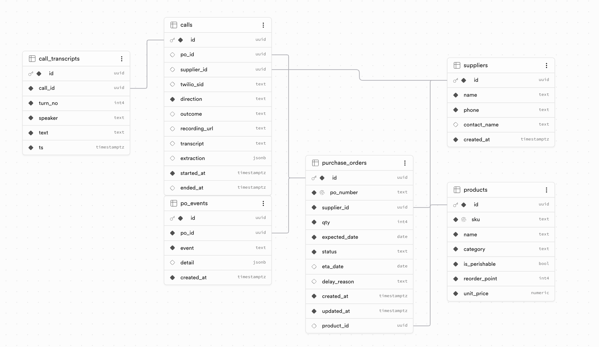
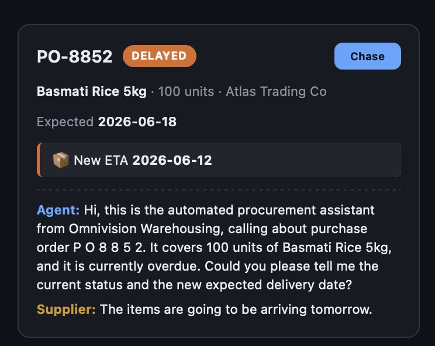

# Omnivision — a voice agent backbone for the warehouse

*AssemblyAI Hackathon submission*

**One reasoning agent, connected to live warehouse data, accessed entirely by voice — and it can pick up the phone.** Floor workers run the WMS hands-free, managers talk to their data, and the inbound team lets the agent **call suppliers** to chase overdue purchase orders: the conversation is held, transcribed, extracted, and the PO status updates on the board automatically.

## The problem

Warehouse operations run on three chronic information gaps:

1. **Floor data is incomplete and late.** Workers with full hands skip data entry; variances, expired stock, and damage get logged hours later (or never) — so the WMS lies.
2. **Managers can't self-serve answers.** Stock, sale-rate, and reorder questions go through dashboards nobody opens or an analyst with a backlog.
3. **Chasing suppliers is manual labor.** "Where's PO-8841?" means a human phoning, holding, and transcribing — hours of pure expediting overhead per week.

Voice-directed warehousing (Vocollect/Zebra) directs predefined pick paths with beeps and scripted prompts. It can't answer an open question, reason over data, or make a phone call. **Omnivision is the answer-and-action layer incumbents don't have.**

## What it does — three personas, one brain

| Persona | Say | The agent |
|---|---|---|
| **Floor worker** | *"Counted 8 of olive oil at aisle 4 bin 12, system says 12"* | Logs the variance, flags it, confirms back — hands-free |
| **Manager** | *"Which products are below reorder point?" … "and which of those have an open PO?"* | Queries live data, answers aloud + on screen, keeps context across follow-ups |
| **Inbound team** | Click **Chase** on an overdue PO | **Phones the supplier**, asks for status/ETA/reason, transcribes the call, extracts structured fields, and flips the PO card live |

Same agent core, same pipeline — only the persona context (system prompt + tool scope) and the audio transport differ.

## How it works

```
audio in ──▶ AssemblyAI Universal-Streaming (STT + end-of-turn detection)
         ──▶ Claude Sonnet 4.6 (persona prompt + scoped tools → Supabase reads/writes)
         ──▶ Cartesia TTS (streaming)
         ──▶ audio out
```

- **AssemblyAI is the perception layer, twice:** Universal-Streaming powers real-time in-app STT with end-of-turn detection for the floor/manager personas, **and** transcribes the supplier side of phone calls.
- **Claude is the reasoning layer, split by latency:** `claude-sonnet-4-6` handles live spoken turns (sub-second first token matters); `claude-opus-4-8` does post-call structured extraction (`{status, eta, reason, confidence}` via JSON schema) where correctness of the DB write is everything. Low-confidence extractions route to *needs review* instead of silently updating.
- **Pipecat** wires the pipeline (turn-taking, barge-in, transports); **Supabase** is the system of record, with Realtime pushing PO-status changes to the dashboard; **FastAPI** hosts it all; **Vite + React** dashboard.

### Data model



**Supplier calls run in local mode by default** — no phone number needed. "Chase" rings a simulated call in the browser; whoever plays the supplier clicks **Answer as supplier** and speaks into the mic. Same pipeline, transcripts, and extraction as real telephony; the Twilio Media Streams path ships in the codebase (`CALL_MODE=twilio`) as the production deployment story.

## Run it

Prereqs: Python 3.11+, Node 18+, a Supabase project, API keys for **AssemblyAI**, **Anthropic**, and **Cartesia**.

```bash
# 1. Env
cp .env.example .env                       # fill in keys (Twilio block stays empty)
cp dashboard/.env.example dashboard/.env   # fill in VITE_SUPABASE_PUBLISHABLE_KEY

# 2. Database (Supabase SQL editor)
#    a. run supabase/schema.sql
#    b. Dashboard → Settings → API → Exposed schemas → add `assemblyai`  ← REQUIRED
#    c. run supabase/seed.sql   (re-run anytime to reset demo data)

# 3. Install + run
make setup          # python venv + pip install, npm install
make server         # FastAPI + Pipecat on :8000
make dashboard      # Vite on :5173
```

Open **http://localhost:5173** in Chrome. Verify health: `curl localhost:8000/health` → `{"ok": true, "missing_settings": []}`.

## Use it (2-minute demo path)

1. **Floor** tab → hold the push-to-talk button → *"where do we keep olive oil?"* → spoken answer + live transcript. Then try logging a variance.
2. **Manager** tab → *"which products are below reorder point?"* → follow up with *"and which of those have an open PO already?"* — context carries over.
3. **Inbound** tab → PO-8841 is red **Overdue** → click **Chase** → click **Answer as supplier** → say: *"Atlas Trading. Yes — that order got held up, we had a raw-material shortage. It's shipping this Friday."* → the agent converses, hangs up, and the card flips to **Delayed — ETA …** live, with the full transcript logged.

### A supplier chase, end to end



What happened on this card, in order:

1. **The agent spoke first** — it dialed out and opened with the PO context preloaded: order number, product, quantity, and the fact it's overdue, then asked for status and a new delivery date. Its own speech is transcribed into the log (**Agent:** line).
2. **The supplier answered** — *"The items are going to be arriving tomorrow."* AssemblyAI transcribed the spoken reply in real time (**Supplier:** line).
3. **The call was logged** — the full two-sided transcript persists with the PO and renders right on the card, an audit trail of the conversation.
4. **The order status changed automatically** — Claude Opus extracted `{status, eta}` from the transcript, the PO flipped to **DELAYED**, and the extracted **New ETA 2026-06-12** appears against the original expected date. No human transcribed or typed anything.

Troubleshooting: `PGRST106` errors mean the `assemblyai` schema isn't exposed (step 2b); a card flipping to *Needs review* means extraction confidence was low — speak clearly and re-Chase. The server terminal logs every transcript and extraction.

## Repo layout

```
plan/         architecture & build docs (start at plan/README.md)
supabase/     schema.sql + seed.sql (demo data)
server/       FastAPI + Pipecat voice pipelines + agent core (personas, tools, extraction)
dashboard/    React dashboard (Floor / Manager / Inbound views)
```

`DEMO_BROWSER.md` and `DEMO_SCRIPTED.md` document two lighter fallback demo modes (browser-TTS-only, and a real Twilio scripted call).

## Honest scope

Supabase stands in for the WMS/ERP (seeded with realistic data); the demo supplier is a human reading a script — voicemail/IVR handling is roadmap; auth is a persona switcher. The bet we're demonstrating: one agent brain, persona-scoped tools, two voice channels — in-app and the public telephone network.
